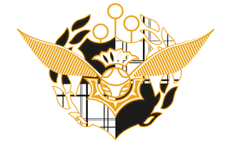

<br>

### Tests  

The emc2 & res practice form is the exact same as both tests.  It is the goal of this course to give you the opportunity to practice and then be tested on a novel, similar problem.  Simply reuse the form provide but APPLY to the test papers that will be posted here.  

Two-part test means two-part process.  
Part 1, work in class collaboratively.  
Part 2, complete at home, digitally typing up work in your own words, and submit to [turnitin.com](https://www.turnitin.com).    

**Test #1 form (same as practice form but complete Q3 in full)**  

[test form #1 as word doc](https://github.com/cjlortie/bio4enviro/blob/master/BIOL4265_emc2.docx)  

[test form #1 as PDF](https://github.com/cjlortie/bio4enviro/blob/master/emc2.pdf)  

**Test 1 publication:** [Direct and interactive effects of climate, meteorology, river hydrology, and lake characteristics on water quality in productive lakes of the Canadian Prairies](http://www.nrcresearchpress.com/doi/10.1139/cjfas-2016-0520#.W6U4zS-ZMWp)  

**Hint for primary tool:** [models - i.e. Modelling ecological systems in a changing world](https://www.ncbi.nlm.nih.gov/pmc/articles/PMC3223798/)  

<br>  

**Test 2 publication:** [Modelling the niche space of desert annuals needs to include positive interactions](https://onlinelibrary.wiley.com/doi/abs/10.1111/oik.04688)  

**Hint for primary tool:** [big data - i.e. Big data and the future of ecology](https://esajournals.onlinelibrary.wiley.com/doi/abs/10.1890/120103) 

ONLY do Question #3 for test 2 for 20% and prepare a short 1-2 minute commercial or scientific comic for the challenge or solution set.  Put creative product online somewhere public or private and share link in the word doc form for test 2.
See marking key below.

[Test 2 form as word doc](https://github.com/cjlortie/bio4enviro/blob/master/BIOL4265_test_form_2.docx)  

[Test 2 form as pdf](https://github.com/cjlortie/bio4enviro/blob/master/BIOL4265_test_form_2.pdf)  


<br>  

**Marking key for test #1**  
```{r, warning=FALSE, message=FALSE, echo=FALSE}
library(tidyverse)
library(knitr)
key <- read_csv("key_tests.csv")
knitr::kable(key)

```


**Marking key for test #2**  
```{r, warning=FALSE, message=FALSE, echo=FALSE}
library(tidyverse)
library(knitr)
key <- read_csv("key_tests_2.csv")
knitr::kable(key)

```

<br>
  
<br>  